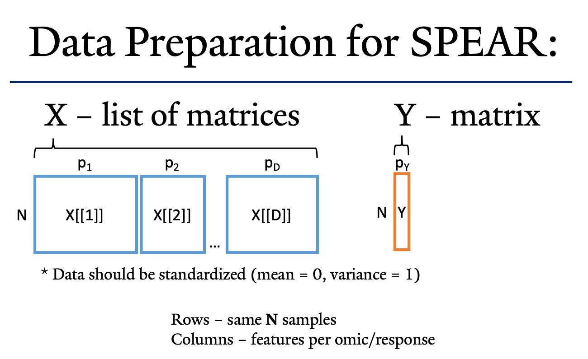

### This vignette will provide a walkthrough for using SPEAR on multi-omic data.

##### Installing SPEAR:

```{r, include = FALSE}
# Set up the path to the downladed tar.gz package:
#path_to_SPEAR_tar.gz <- "~/Dropbox/shared_folder/SPEARcomplete_1.0.tar.gz"

# Run this command to install the SPEARcomplete (SPEAR) package
#install.packages(path_to_SPEAR_tar.gz, repos = NULL, type="source")

# If this fails, you may need to install these packages:
#install.packages('BH')
#install.packages('Rcpp')
#install.packages('RcppArmadillo')
#install.packages('glmnet')
```

##### Required Libraries:

```{r}
# Required Packages for SPEAR:
library(SPEARcomplete)
library(glmnet)
library(parallel)

# Recommended Packages (for downstream analysis):
path_to_SPEARkit <- "~/Dropbox/shared_folder/SPEARkit/SPEARkit.R"
source(path_to_SPEARkit)
library(jsonlite)
library(dplyr)
library(reshape2)
library(stringr)
library(ggplot2)
library(cowplot)

```

### Loading the multi-omic data:



Loading your own multi-omic data:

```{r}
# Parameters:
# X - a list of matrices of omics data [subjects = rows, features = columns] (i.e. OmicsData 1 would be X[[1]], ...)
# Y - a matrix of response data [subjects = rows, response.variables = columns] (i.e. Response1 would be Y[,1], ...)
# 
# Data should be scaled/standardized (mean = 0, variance = 1) before using SPEAR:

X <- NULL # Replace with your list of matrices...
Y <- NULL # Replace with your matrix...
```

Loading simulated multi-omic data: (skip this if using your own data)

```{r}
# Generated from the SPEAR_simulate_data.Rmd file:
path_to_sim_data <- getwd() # Replace with the path to the 'simulated_gaussian_data.rds' file
sim.data <- readRDS(paste0(path_to_sim_data, "/simulated_gaussian_data.rds"))

X <- sim.data$data.tr$xlist
Y <- sim.data$data.tr$Y
```

Naming the features, subjects, and datasets (for downstream analysis):

```{r}
colnames(Y) <- "GausResponse"
rownames(Y) <- paste0("Subject", 1:nrow(Y))
names(X) <- paste0("OmicsData", 1:length(X))
for(i in 1:length(X)){
  colnames(X[[i]]) <- paste0(names(X)[i], "_feat", 1:ncol(X[[i]]))
  rownames(X[[i]]) <- paste0("Subject", 1:nrow(X[[i]]))
}

# Make sure the subjects (rows) are consistent across X and Y
all(rownames(Y) == rownames(X[[1]]))
```

##### Running SPEAR:

```{r}
# Run the cv version of SPEAR
#    Main Parameters:
# X - Omics datasets (as list of matrices). Rows = subjects, columns = features
# Y - Response (as matrix). Rows = subjects, columns = response features
#
#    Other Parameters:
num.factors = 5 # How many factors should SPEAR generate? 5-10 should be sufficient for most cases
save.path <- getwd() # path for SPEARobject (rds file) to be saved
save.name <- "SPEAR_vignette_object.rds" # name for SPEARobject (rds file)
seed <- 123 # reproducible seed

# Running cross-validated SPEAR:
SPEARobj <- run_cv_spear(X = X, 
                         Y = Y, 
                         num.factors = num.factors, 
                         seed = seed, 
                         save.path = save.path, 
                         save.name = save.name)

# This SPEARobj (SPEAR object) is already saved to an rds file (see SPEAR printed output for location)

# For downstream analysis, continue with SPEAR_downstream_vignette.Rmd (need a SPEARobj)
```

