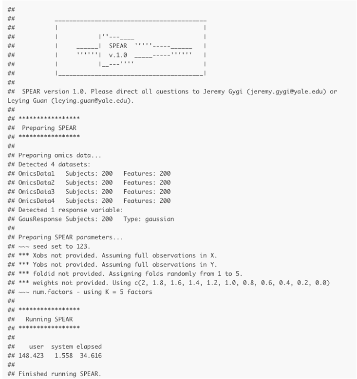

### This vignette will provide a walkthrough for using SPEAR on multi-omic data.

##### Installing SPEAR:

Follow installation instructions in README (located [here](https://github.com/jgygi/SPEAR))

##### Required Libraries:

```{r message = FALSE, warning = FALSE}
# Required Packages for SPEAR:
library(SPEARcomplete)
library(glmnet)
library(parallel)
library(ordinalNet)

# Recommended Packages (for downstream analysis):
library(jsonlite)
library(dplyr)
library(reshape2)
library(stringr)
library(ggplot2)
library(cowplot)

```

### Loading the multi-omic data:

{width=80%}

Loading your own multi-omic data:

```{r}
# Parameters:
# X - a list of matrices of omics data [subjects = rows, features = columns] (i.e. OmicsData 1 would be X[[1]], ...)
# Y - a matrix of response data [subjects = rows, response.variables = columns] (i.e. Response1 would be Y[,1], ...)
# 
# Data should be scaled/standardized (mean = 0, variance = 1) before using SPEAR:

X <- NULL # Replace with your list of matrices...
Y <- NULL # Replace with your matrix...
```

Loading simulated multi-omic data: (skip this if using your own data)

```{r}
# Generated from the SPEAR_simulate_data.Rmd file:
path_to_sim_data <- "" # Replace with the path to the 'simulated_gaussian_data.rds' file
sim.data <- readRDS(paste0(path_to_sim_data, "simulated_gaussian_data.rds"))

X <- sim.data$data.tr$xlist
Y <- sim.data$data.tr$Y
```

Naming the features, subjects, and datasets (for downstream analysis):

```{r}
colnames(Y) <- "GausResponse"
rownames(Y) <- paste0("Subject", 1:nrow(Y))
names(X) <- paste0("OmicsData", 1:length(X))
for(i in 1:length(X)){
  colnames(X[[i]]) <- paste0(names(X)[i], "_feat", 1:ncol(X[[i]]))
  rownames(X[[i]]) <- paste0("Subject", 1:nrow(X[[i]]))
}

# Make sure the subjects (rows) are consistent across X and Y
all(rownames(Y) == rownames(X[[1]]))
```

### Running SPEARgaussian:

```{r}
# Run the cv version of SPEAR
#    Main Parameters:
# X - Omics datasets (as list of matrices). Rows = subjects, columns = features
# Y - Response (as matrix). Rows = subjects, columns = response features
#
#    Other Parameters:
num.factors = 5 # How many factors should SPEAR generate? 5-10 should be sufficient for most cases
save.path <- getwd() # path for SPEARobject (rds file) to be saved
save.name <- "SPEAR_vignette_object.rds" # name for SPEARobject (rds file)
seed <- 123 # reproducible seed
```

Running SPEAR: Set 'eval=TRUE' to run SPEAR below.

```{r eval=FALSE}
# Running cross-validated SPEAR:
SPEARobj <- run_cv_spear(X = X, 
                         Y = Y, 
                         num.factors = num.factors, 
                         seed = seed, 
                         save.path = save.path, 
                         save.name = save.name)


# This SPEARobj (SPEAR object) is already saved to an rds file (see SPEAR printed output for location)

# For downstream analysis, continue with SPEAR_downstream_vignette.Rmd (need a SPEARobj)
```

You should see something like this (if the package is installed correctly)


### Running SPEARordinal, SPEARbinomial, and SPEARcategorical:

SPEAR supports the following options for the `family` parameter:

```{r echo=FALSE, message=FALSE, warnings=FALSE}
options <- c("gaussian", "binomial", "ordinal", "categorical")
descriptions <- c("Continuous values (scaled)", 
                  "0's or 1's", 
                  "Ranked scale of integers (start at 0)", 
                  "Multiple binomial (0/1) columns")
notes <- c("Yes", "No", "No", "No")
cols <- c("Yes", "Yes (categorical)", "No", "Yes")

df <- data.frame(options, descriptions, notes, cols)
colnames(df) <- c("Parameter", "Values in Y (Response)", "Should Y be scaled?", "Can Y have >1 cols?")
knitr::kable(df)
```

#### Setting up SPEAR with a different family:

Below are examples of what Y should look like to use a different family:

##### Gaussian

```{r}
# Gaussian, A continuous response
family = "gaussian"
Y_gaussian    <- data.frame(GausResponse = rnorm(10))
```

```{r echo = FALSE}
df <- Y_gaussian
rownames(df) <- paste0("Sample", 1:nrow(df))
print(df)
```

```{r}
# Gaussian can have more than one column
#   One column in Y per response
family = "gaussian"
Y_gaussian.multi    <- data.frame(GausResponse1 = rnorm(10), GausResponse2 = rnorm(10))
```

```{r echo = FALSE}
df <- Y_gaussian.multi
rownames(df) <- paste0("Sample", 1:nrow(df))
print(df)
```

##### Binomial

```{r}
# Binomial, A response that is either 1 (TRUE) or 0 (FALSE)
#   One column in Y per response
family = "binomial"
Y_binomial    <- data.frame(BinomResponse = c(0,1,0,1,1,0,1,0,0,1))
```

```{r echo = FALSE}
df <- Y_binomial
rownames(df) <- paste0("Sample", 1:nrow(df))
print(df)
```

##### Categorical

```{r}
# Categorical, multilple groups without an ordinal scale
# Same as binomial, but with multiple columns
#   One column in Y per response
#   Value = 1 if belongs to class, 0 otherwise
family = "categorical" #or "binomial"
Y_categorical <- data.frame(Category1 = c(1,0,0,0,0,0,1,0,0,1),
                            Category2 = c(0,0,1,0,0,0,0,0,1,0),
                            Category3 = c(0,1,0,1,0,1,0,0,0,0),
                            Category4 = c(0,0,0,0,1,0,0,1,0,0))
```

```{r echo = FALSE}
df <- Y_categorical
rownames(df) <- paste0("Sample", 1:nrow(df))
print(df)
```

##### Ordinal

```{r}
# Ordinal, multiple groups that can be ranked
#     Only supports one column
#     Value is an integer between 0 and the the number of classes minus 1 (-1)
#     Lowest class starts at 0
family = "ordinal"
Y_ordinal     <- data.frame(OrdinalResponse = sample(c(0:4), 10, replace = TRUE))
```

```{r echo = FALSE}
df <- Y_ordinal
rownames(df) <- paste0("Sample", 1:nrow(df))
print(df)
```


Once Y is set up, run SPEAR the same way as above (Gaussian), but change the family parameter (`"binomial"`, `"ordinal"`, `"categorical"`).

Look at 'SPEAR_3_downstream_vignette' for instructions on how to perform downstream analysis with all families of SPEAR.
