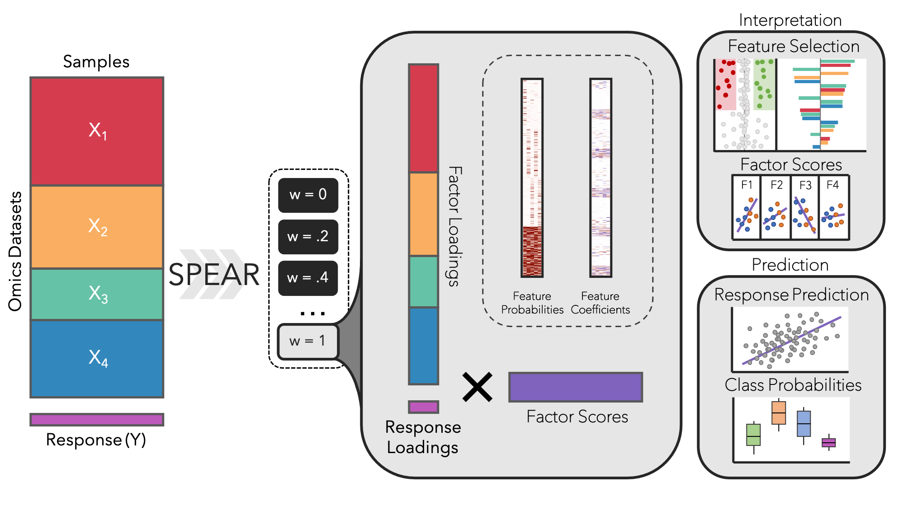
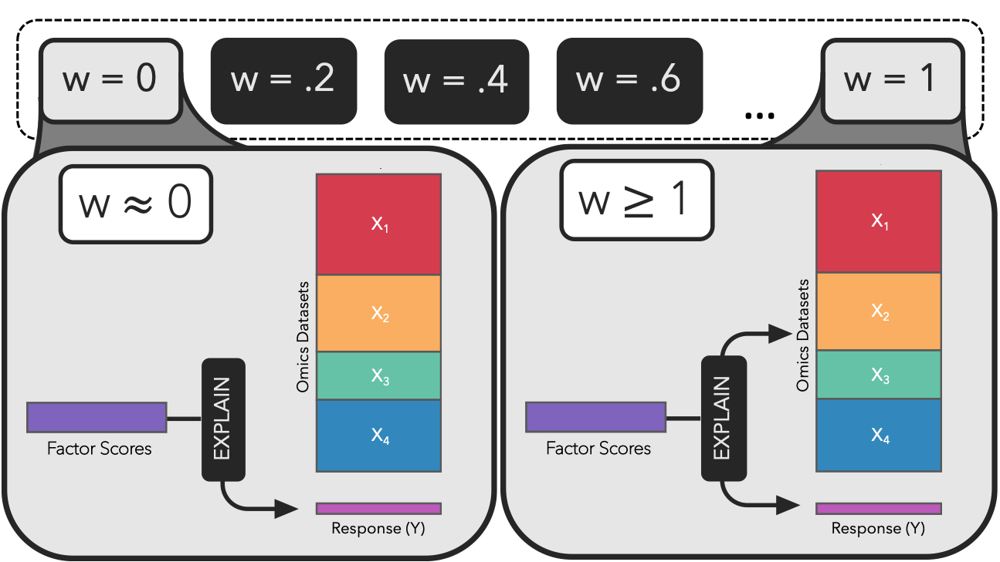

### This vignette will provide insight into downstream analysis using SPEAR:

1. Analyzing all SPEAR models (including SPEARgaussian)

2. Functions specific to SPEARordinal, SPEARbinomial, and SPEARcategorical models

##### Installing SPEAR:

Follow installation instructions in README (located [here](https://github.com/jgygi/SPEAR))

##### Required Libraries:

```{r message = FALSE, warning = FALSE}
# Required Packages for SPEAR:
library(SPEAR)

# Recommended Packages (for downstream analysis):
library(dplyr)
library(reshape2)
library(stringr)
library(ggplot2)
library(cowplot)
```

### Overview

{width=100%}

### The SPEARobject

```{r}
# Load in the SPEARobject saved from running SPEAR:
file.path <- getwd()
SPEARobj <- readRDS(paste0(file.path, "/SPEAR_vignette_object_gaussian.rds"))
names(SPEARobj)
```

The SPEAR object returned has 4 components:
1. fit (the cross-validated SPEAR object)
2. cv.eval (the results from evaluating the fit object)
3. params (the parameters used for this specific SPEAR object)
4. data (the data used to train the SPEAR models in the object)

*Variables used to reference results:*

+ $N$ - number of subjects [nrow($X$)]

+ $P$ - number of total features (across all omics) [ncol($X$)]

+ $D$ - number of omics datasets [length($X$)]

+ $G$ - number of groups of subjects (typically 1)

+ $Y$ - number of response vars [ncol($Y$)]

+ $K$ - number of factors SPEAR constructed

+ $W$ - number of weights used in CV

+ $F$ - number of folds used in CV


1. fit - the cross-validated SPEAR object

    + results
    
        + post_betas ($P$ x $K$ x $G$ x $W$)
        
        + post_bys ($K$ x $Y$ x $W$)
        
        + post_bxs ($K$ x $P$ x $W$)
        
        + post_pis ($P$ x $K$ x $W$)
        
        + post_selections ($P$ x $K$ x $W$)
        
        + interceptsX ($P$)
        
        + interceptsY ($Y$)
        
    + factors_coefs ($P$ x $K$ x $G$ x $F$ x $W$) # combine by F for out of sample
    
    + projection_coefs ($K$ x $Y$ x $F$ x $W$)    #
    
    + foldid ($N$)
    
2. cv.eval - results from evaluating 'fit'

    + projection_coefs ($K$ x $Y$ x $W$) # after getting coefficients, use all data
    
    + reg_coefs ($P$ x $G$ x $Y$ x $W$)
    
    + intercepts ($Y$)
    
    + cvm ($W$ x $Y$)
    
    + cvsd ($W$ x $Y$)
    
    + factor_contributions ($K$ x $Y$ x $W$)
    
    + Yhat.keep ($N$ x $Y$ x $W$) # cv.predictions
    
3. params - the parameters used to generate 'fit' by SPEAR

    + weights ($W$) - values of '$w$' used in SPEAR
    
    + foldid ($N$) - integer of 1:$F$
    
    + seed
    
    + num_factors
    
    + max_iter
    
    + thres_elbo
    
    + thres_count
    
4. data - the data used by SPEAR

While it isn't necessary to extract these matrices directly from the model, it is useful to understand where the results are coming from. Most typical downstream analyses can be performed using the built-in SPEAR functions described below.

### Weight parameter 'w'

SPEAR generates factors based on a weight parameter, $w$. This parameter helps drive the factor construction process:

{width=100%}

When $w\approx0$, it means that SPEAR will focus on generating factors that explain the response ($Y$). 

When $w\ge1$, it means that SPEAR is equally considering the relationship between the constructed factors and both the datasets ($X$) and the response ($Y$). 

This $w$ parameter is tuned automatically, meaning SPEAR will return factors constructed on the "best" $w$ (based on mean cross-validated prediction error from the training) by default. 

SPEAR will generate a different set of factors for each value supplied in the 'weights' argument (if no argument is supplied, will default to c(2, 1.8, 1.6, 1.4, 1.2, 1.0, 0.8, 0.6, 0.4, 0.2, 0.0).
```{r}
# Check values of 'w' (weights) used by SPEAR:
SPEARobj$params$weights
```

SPEAR uses the mean cross-validation error to determine which is the best $w$ to use.
```{r}
# Get best weights (w):
SPEAR::SPEAR.get_best_weights(SPEARobj, w.method = 'min')
SPEAR::SPEAR.get_best_weights(SPEARobj, w.method = 'sd')
```

Why did SPEAR return a different "best" $w$? Let's plot the mean cross-validation errors to visualize the impact of $w$ on the data.

```{r fig.width = 7, fig.height = 5}
SPEAR::SPEAR.plot_cv_loss(SPEARobj)
```

This function will plot the overall minimum cross validation loss for a SPEAR object (mean cross validation error for `family = "gaussian"`). 

It looks like $w = 1.8$ was barely the lowest overall, but because $w = 2.0$ is a higher weight within 1 cross validation standard deviation, we choose $w = 2$ when `w.method = 'sd'`. 

Whenever $w \ge 1$ the results are typically quite similar, so this shouldn't change too much.

### The SPEARmodel

Once we have chosen a value of $w$ to use, we can generate a SPEARmodel:

```{r}
SPEARmodel <- SPEAR::get_SPEAR_model(SPEARobj)
```

The SPEARmodel is similar to a SPEARobject, but it is used for a single $w$ value. Most downstream functions built into the SPEAR package utilize a SPEARmodel as input.

Let's see what value of $w$ our SPEAR model is using:

```{r}
SPEARmodel$params$w
```

There are other ways to specify which value of $w$ a SPEARmodel should use:

```{r eval = FALSE}
### Specifying w.method:
# Get a SPEARmodel for lowest cv error:
SPEARmodel <- SPEAR::get_SPEAR_model(SPEARobj, w.method = "min")
# Get a SPEARmodel for the highest weight within 1 sd of the lowest cv error:
SPEARmodel <- SPEAR::get_SPEAR_model(SPEARobj, w.method = "sd")

### Specifying w:
# Note: if the provided weight is not within the provided weights
#       (SPEARobj$params$weights), it will return the closest weight 
#       to the value provided.
SPEARmodel <- SPEAR::get_SPEAR_model(SPEARobj, w = 0)
SPEARmodel <- SPEAR::get_SPEAR_model(SPEARobj, w = 1)
```

(TO ADD: Section on different families, bring back figure from vignette 2)

### Analyzing SPEARmodels with different `family` arguments: 

#### SPEARgaussian

1. Load the SPEARobject:

```{r}
file.path <- getwd()
SPEARobj.gaussian <- readRDS(paste0(file.path, "/SPEAR_vignette_object_gaussian.rds"))
```

2. Choose a weight for a SPEARmodel:

```{r fig.width = 7}
# Plot cv loss:
SPEAR::SPEAR.plot_cv_loss(SPEARobj.gaussian)
```

This is the same SPEARobject used above, so we will use the SPEARmodel for $w = 2$:

```{r}
SPEARmodel.w2 <- SPEAR::get_SPEAR_model(SPEARobj.gaussian, w = 2)
```

For this vignette, we will also make a $w = 0$ model to demonstrate the differences between $w = 0$ and $w \ge 1$.

```{r}
SPEARmodel.w0 <- SPEAR::get_SPEAR_model(SPEARobj.gaussian, w = 0)
```


##### Factor Contributions:

We can see how much is explained from both the $w = 2$ and $w = 0$ SPEARmodels:

```{r fig.width = 7, fig.height = 5, warning=FALSE}
SPEAR::SPEAR.plot_factor_contributions(SPEARmodel.w2)
SPEAR::SPEAR.plot_factor_contributions(SPEARmodel.w0)
```

##### Factor Scores

Because SPEAR is run through cross-validation, you can choose to inspect the `in.sample` factors (those generated by $$all$$ of the training data) as well as the `out.of.sample` factors (each fold uses the factors generated from when it is left out as a validation set). This is done with the `forecast` argument:

```{r fig.width = 7, fig.height = 4}
SPEAR::SPEAR.plot_factor_scores(SPEARmodel.w2, forecast = 'out.of.sample')
```

 Removing the jitter:
 
```{r fig.width = 7, fig.height = 2.5}
SPEAR::SPEAR.plot_factor_scores(SPEARmodel.w2, forecast = 'out.of.sample', jitter.points = FALSE)
```

These plots don't show much on their own. Let's add a `groups` argument. This will color the points by some variable defined in a named vector... We can give each point (a sample) their respective response value as a group:

```{r fig.width = 7, fig.height = 2.5}
custom.groups <- SPEARmodel.w2$data$Y
names(custom.groups) <- rownames(SPEARmodel.w2$data$Y)
SPEAR::SPEAR.plot_factor_scores(SPEARmodel.w2, groups = custom.groups, forecast = 'out.of.sample')
```

It looks like Factors 1 and 2 have strong correlations with the group (we set to Y).

You can set the `groups` parameter to be continuous or categorical. Here we will bin our continuous response into different groups based on rounding them down to their nearest integer:

```{r fig.width = 7, fig.height = 2.5}
custom.groups <- factor(floor(SPEARmodel.w2$data$Y))
names(custom.groups) <- rownames(SPEARmodel.w2$data$Y)
SPEAR::SPEAR.plot_factor_scores(SPEARmodel.w2, groups = custom.groups, forecast = 'out.of.sample')
```

What do the `in.sample` factor scores look like? We hope to not see much difference (this would mean the model overfit to the training data)...

```{r fig.width = 7, fig.height = 2.5}
custom.groups <- factor(floor(SPEARmodel.w2$data$Y))
names(custom.groups) <- rownames(SPEARmodel.w2$data$Y)
SPEAR::SPEAR.plot_factor_scores(SPEARmodel.w2, groups = custom.groups, forecast = 'in.sample')
```

They look very similar, with the exception of a few samples (see Factor 3 group 2, they appear a bit lower). This means the model appears to be generalizable to test (external) data.

##### Feature Selection:

Let's inspect the loadings matrix and the probabilities.

The loadings represent the coefficients used by SPEAR to convert the Omics data (X) into the factor scores...

```{r fig.width = 4, fig.height = 5, fig.align = "center"}
SPEAR::SPEAR.plot_factor_loadings(SPEARmodel.w2)
```

It looks like OmicsData4 has a lot of high coefficients compared to the other Omics datasets. Let's look at the post selection probabilities of the features...

The probabilities represent the posterior selection probabilities assigned by SPEAR to each feature...

```{r fig.width = 4, fig.height = 5, fig.align = "center"}
SPEAR::SPEAR.plot_factor_probabilities(SPEARmodel.w2)
```

Again, it looks like OmicsData4 is the dataset that has the most features that are used in our model. Let's find out what the features are using the `SPEAR.get_feature_table` function...

```{r}
feature.table <- SPEAR::SPEAR.get_feature_table(SPEARmodel.w2, factors = 1:5, omics = "OmicsData4")
head(feature.table)
```

This function (`SPEAR.get_feature_table`) will return a data.frame table with:

+ **Feature** (the name supplied to SPEAR, taken from colnames(SPEARmodel\$data\$X))

+ **Omic** (which dataset does the feature belong to? Taken from names(SPEARmodel\$data\$xlist))

+ **Factor** (Which factor is being referenced? The same feature may appear with a different **Coefficient**/**Probability** for different **Factor**)

+ **Coefficient** (the loading given to the feature for the respective **Factor**)

+ **Probability** (the posterior selection probability given to the feature for the respective **Factor**)

This function (`SPEAR.get_feature_table`) can accept many cutoff parameters to return a specific set of features:

```{r eval = FALSE}
# Specifying which factors:
feature.table <- SPEAR::SPEAR.get_feature_table(SPEARmodel.w2, factors = c(1,2,4))

# Specifying which omics:
feature.table <- SPEAR::SPEAR.get_feature_table(SPEARmodel.w2, omics = c("OmicsData1", "OmicsData4"))

# Only return features with a probability >= .5:
feature.table <- SPEAR::SPEAR.get_feature_table(SPEARmodel.w2, probability.cutoff = .5)

# Only return features with a coefficient >= .01:
feature.table <- SPEAR::SPEAR.get_feature_table(SPEARmodel.w2, coefficient.cutoff = .01)
```

Let's get another visual representation of the top factors:

## TODO: Finish adding explanations from here on...

```{r, fig.width = 7, fig.height = 6}
SPEAR::SPEAR.plot_feature_distribution(SPEARmodel.w2)
```

```{r, fig.width = 7, fig.height = 7}
SPEAR::SPEAR.plot_feature_summary(SPEARmodel.w2, factors = 1:2, max.per.factor = 50)
```

```{r, fig.width = 7, fig.height = 7}
SPEAR::SPEAR.plot_feature_summary(SPEARmodel.w2, factors = 1:2, max.per.factor = 50, sort.by = "coefficient")
```

##### Prediction:

```{r}
# Load in the SPEARobject saved from running SPEAR:
file.path <- getwd()
SPEARobj.categorical <- readRDS(paste0(file.path, "/SPEAR_vignette_object_categorical.rds"))
```

```{r}
SPEARmodel.w2 <- SPEAR::get_SPEAR_model(SPEARobj.categorical, w = 2)
```

```{r fig.width = 7, fig.height = 4}
SPEAR::SPEAR.plot_class_predictions(SPEARmodel.w2)
```


